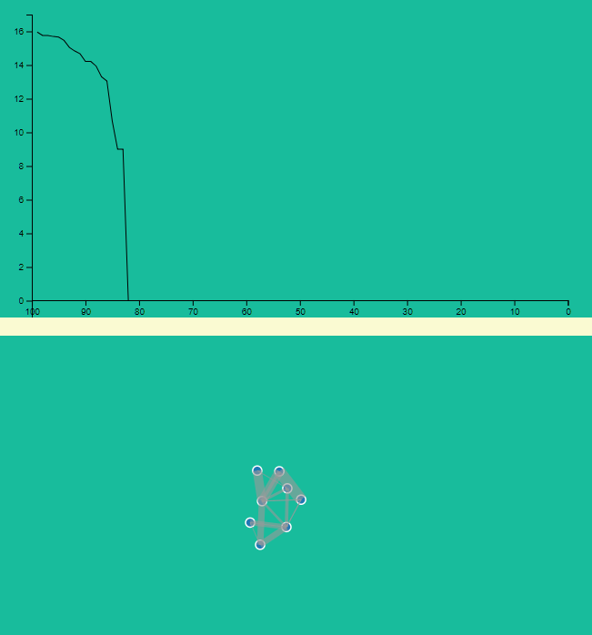

### Rust NEAT
[](https://travis-ci.org/TLmaK0/rustneat)
[](https://gitter.im/rustneat/rustneat)

Implementation of **NeuroEvolution of Augmenting Topologies NEAT** http://nn.cs.utexas.edu/downloads/papers/stanley.ec02.pdf

This implementations uses a **Continuous-Time Recurrent Neural Network** (**CTRNN**) (Yamauchi and Beer, 1994).

## Run test

To speed up tests, run them with `--release` (XOR classification/simple_sample should take less than a minute)

`cargo test --release`
## Run example

`cargo run --release --example simple_sample --features=telemetry`

then go to `http://localhost:3000` to see how neural network evolves



## Sample usage

Create a new cargo project:

Add rustneat to Cargo.toml
```
[dependencies]
rustneat = "0.1.5"
```

Then use the library i.e. to implement the above example, use the library as follows:

```rust
extern crate rustneat;
use rustneat::Environment;
use rustneat::Organism;
use rustneat::Population;

struct XORClassification;

impl Environment for XORClassification {
    fn test(&self, organism: &mut Organism) -> f64 {
        let mut output = vec![0f64];
        let mut distance: f64;
        organism.activate(&vec![0f64, 0f64], &mut output);
        distance = (0f64 - output[0]).abs();
        organism.activate(&vec![0f64, 1f64], &mut output);
        distance += (1f64 - output[0]).abs();
        organism.activate(&vec![1f64, 0f64], &mut output);
        distance += (1f64 - output[0]).abs();
        organism.activate(&vec![1f64, 1f64], &mut output);
        distance += (0f64 - output[0]).abs();
        (4f64 - distance).powi(2)
    }
}

fn main() {
    let mut population = Population::create_population(150);
    let mut environment = XORClassification;
    let mut champion: Option<Organism> = None;
    while champion.is_none() {
        population.evolve();
        population.evaluate_in(&mut environment);
        for organism in &population.get_organisms() {
            if organism.fitness > 15.9f64 {
                champion = Some(organism.clone());
            }
        }
    }
    println!("{:?}", champion.unwrap().genome);
}

```

# Develop
Check style guidelines with:

`cargo install rustfmt`
`cargo fmt -- --write-mode=diff`
