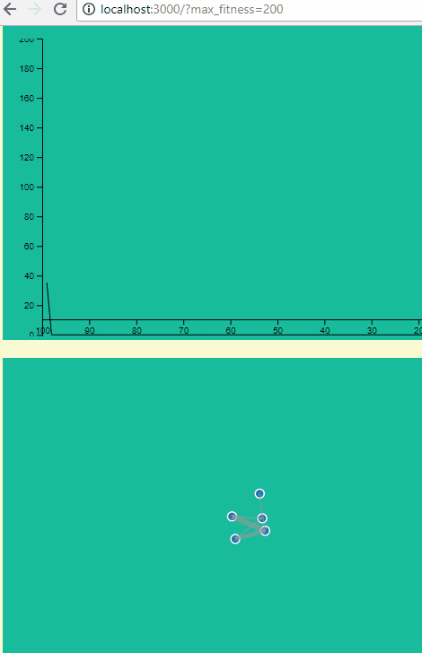
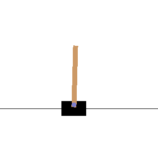
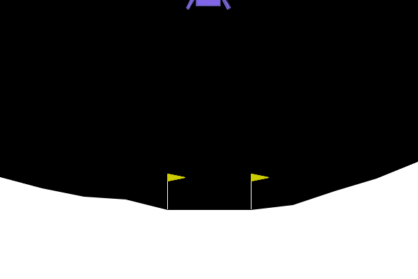

### Rust NEAT
[](https://github.com/TLmaK0/rustneat/actions/workflows/ci.yml)
[](https://gitter.im/rustneat/rustneat)

Implementation of **NeuroEvolution of Augmenting Topologies NEAT** http://nn.cs.utexas.edu/downloads/papers/stanley.ec02.pdf

This implementation uses a **CTRNN** (Continuous-Time Recurrent Neural Network) based on **On the Dynamics of Small Continuous-Time Recurrent Neural Network** (Beer, 1995) http://www.cs.uvm.edu/~jbongard/2014_CS206/Beer_CTRNNs.pdf

### CTRNN time constant (τ)

The time constant τ controls neuron response speed — like biological membrane resistance time. What matters is the ratio `dt/τ` where `dt=0.01` is the simulation step. Configurable via `MutationConfig::tau`:

- **Small τ** (e.g. 0.01): `dt/τ = 1.0` — neurons react instantly, state resets each step. Network behaves as **feedforward**. Use for stateless problems like XOR.
- **Large τ** (e.g. 0.1): `dt/τ = 0.1` — neurons update only 10% per step, retaining 90% of previous state. Network has **temporal memory**. Use for control tasks like Lunar Lander where the agent integrates information over time.
- **Very large τ** (e.g. 1.0): `dt/τ = 0.01` — neurons barely respond, very strong inertia. Needs many steps to react to new inputs.

## Telemetry Dashboard


```bash
cargo run --release --example simple_sample --features=telemetry
```

Then go to `http://localhost:3000` to see how the neural network evolves.



## Cart Pole



## Lunar Lander

NEAT+CTRNN agent evolved to land on the OpenAI Gym LunarLander-v3 environment using discrete actions with independent threshold-based output control.



### Results
- **Verified average reward**: +70 (fitness 570 with +500 offset)
- **Peak reward**: +278 (fitness 778)
- **Solved threshold**: average reward +200

The agent uses 2 independent CTRNN outputs (main thruster, lateral direction) with lateral priority — a key insight for CTRNN control problems where argmax causes state lock-in.

### Run

```bash
cargo build --release --example openai_lunar_lander --features openai
./target/release/examples/openai_lunar_lander
```

### Test champion

```bash
cargo build --release --example test_champion --features openai
./target/release/examples/test_champion
```

## Install Rust

```bash
curl --proto '=https' --tlsv1.2 -sSf https://sh.rustup.rs | sh
source $HOME/.cargo/env
```

## Run tests

To speed up tests, run them with `--release` (XOR classification/simple_sample should take less than a minute):

```bash
cargo test --release
```

## Sample usage

Create a new cargo project and add rustneat to Cargo.toml:

```toml
[dependencies]
rustneat = "0.2.1"
```

Then use the library to implement XOR classification:

```rust
extern crate rustneat;
use rustneat::Environment;
use rustneat::Organism;
use rustneat::Population;

struct XORClassification;

impl Environment for XORClassification {
    fn test(&self, organism: &mut Organism) -> f64 {
        let mut output = vec![0f64];
        let mut distance: f64;
        organism.activate(&vec![0f64, 0f64], &mut output);
        distance = (0f64 - output[0]).abs();
        organism.activate(&vec![0f64, 1f64], &mut output);
        distance += (1f64 - output[0]).abs();
        organism.activate(&vec![1f64, 0f64], &mut output);
        distance += (1f64 - output[0]).abs();
        organism.activate(&vec![1f64, 1f64], &mut output);
        distance += (0f64 - output[0]).abs();
        (4f64 - distance).powi(2)
    }
}

fn main() {
    let mut population = Population::create_population(150);
    let mut environment = XORClassification;
    let mut champion: Option<Organism> = None;
    while champion.is_none() {
        population.evolve();
        population.evaluate_in(&mut environment);
        for organism in &population.get_organisms() {
            if organism.fitness > 15.9f64 {
                champion = Some(organism.clone());
            }
        }
    }
    println!("{:?}", champion.unwrap().genome);
}
```

## Develop

Check style guidelines with:

```bash
rustup component add rustfmt-preview
cargo fmt
```

## References

- **NeuroEvolution of Augmenting Topologies NEAT** http://nn.cs.utexas.edu/downloads/papers/stanley.ec02.pdf
- **On the Dynamics of Small Continuous-Time Recurrent Neural Network** (Beer, 1995) http://www.cs.uvm.edu/~jbongard/2014_CS206/Beer_CTRNNs.pdf
- **An Investigation into the Dynamics of a Continuous Time Recurrent Neural Network Node** http://www.tinyblueplanet.com/easy/FCSReport.pdf

## Thanks

Thanks for the icon nerves by Delwar Hossain from the Noun Project
